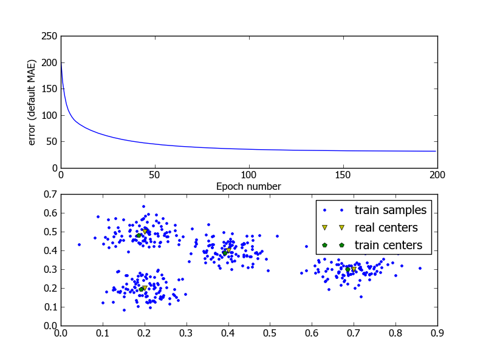

**********************
Classification Problem
**********************

Import::

	import neurolab as nl
	import numpy as np
	import numpy.random as rand

Create train samples::

	centr = np.array([[0.2, 0.2], [0.4, 0.4], [0.7, 0.3], [0.2, 0.5]])
	rand_norm = 0.05 * rand.randn(100, 4, 2)
	inp = np.array([centr + r for r in rand_norm])
	inp.shape = (100*4, 2)
	rand.shuffle(inp) 

Create network::

	# Create net with 2 inputs and 4 neurons
	net = nl.net.newc([[0.0, 1.0],[0.0, 1.0]], 4)

Train CWTA process::

	>>> error = net.train(inp, epochs=200, show=20)
	... Epoch: 20; Error: 65.0137759794;
	... Epoch: 40; Error: 48.6917931066;
	... Epoch: 60; Error: 41.9095219357;
	... Epoch: 80; Error: 38.3405623702;
	... Epoch: 100; Error: 36.0688624222;
	... Epoch: 120; Error: 34.4855972244;
	... Epoch: 140; Error: 33.3377109438;
	... Epoch: 160; Error: 32.5040186804;
	... Epoch: 180; Error: 31.9165709487;
	... Epoch: 200; Error: 31.4907753318;
	... Stop by epochs
	
Plot results::

	>>> import pylab as pl
	>>> pl.title('Classification Problem')
	>>> pl.subplot(211)
	>>> pl.plot(error)
	>>> pl.xlabel('Epoch number')
	>>> pl.ylabel('error (default MAE)')

	>>> w = net.layers[0].np['w']

	>>> pl.subplot(212)
	>>> pl.plot(inp[:,0], inp[:,1], '.', \
	... 	centr[:,0], centr[:, 1] , 'yv', \
	... 	w[:,0], w[:,1], 'p')
	>>> pl.legend(['train samples', 'real centers', 'train centers'])
	>>> pl.show()

:Result:
