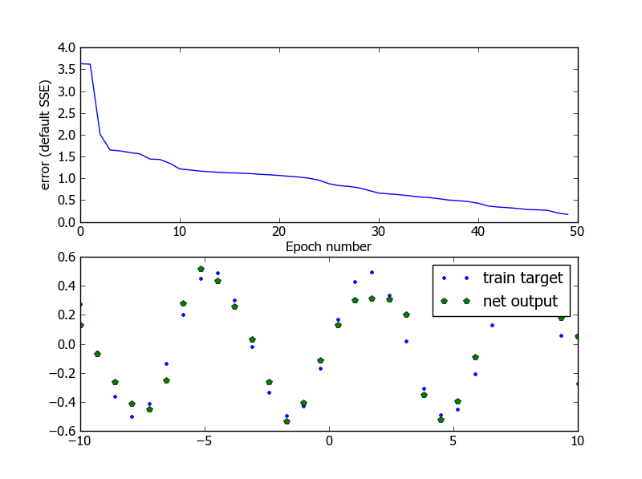

******************************
Aproximation of the 0.5*sin(x)
******************************
:Import:
	>>> import neurolab as nl
	>>> import numpy as np

:Create train samples:
	>>> input = np.linspace(-10, 10, 30).reshape([30,1])
	>>> target = (np.sin(input) * 0.5)

	>>> # Create network with 2 layers and rendom initialized
	>>> net = nl.net.newff([[-0.5, 0.5]],[15, 15, 1])
	>>> # Change train function
	>>> net.trainf = nl.train.train_bfgs
:Train process:
	>>> error = net.train(input, target, epochs=500, goal=0.2)

	>>> output = net.sim(input)

:Plot result:
	>>> import pylab as pl
	>>> pl.title('Aproximation of the 0.5*sin')
	>>> pl.subplot(211)
	>>> pl.plot(error)
	>>> pl.xlabel('Epoch number')
	>>> pl.ylabel('error (default SSE)')

	>>> pl.subplot(212)
	>>> pl.plot(input.flat , target.flat, '.', input.flat, output.flat, 'p')
	>>> pl.legend(['train target', 'net output'])
	>>> pl.show()

:Result:
